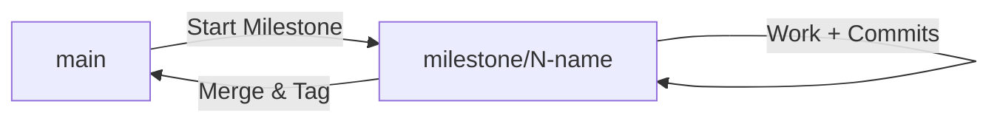

# Branching Strategy — Solo Developer Workflow

This document defines a simplified branching and versioning strategy tailored for a solo developer to ensure efficiency without unnecessary overhead.

## 1. Branch Hierarchy



| Branch | Purpose | Usage |
|---|---|---|
| `main` | Stable, production-ready code. | Only merge milestones here. |
| `milestone/*` | Active development branch for the current Milestone. | All tasks are committed here directly. |

## 2. Solo Workflow Steps

### Step 1: Start a New Milestone
Create a branch for the upcoming Milestone from `main`:
```bash
git checkout main
git checkout -b milestone/N-short-name
```

### Step 2: Develop Tasks
Work on individual tasks (2.1, 2.2, etc.) directly on the milestone branch. Commit each task completion with a clear message:
```bash
git add .
git commit -m "feat: complete task 2.1 - configure pydantic settings"
```
*Tip: No need for separate task branches.*

### Step 3: Complete & Merge
Once all tasks for the Milestone are finished and verified (Definition of Done):
```bash
git checkout main
git merge milestone/N-short-name
git tag vN.0  # e.g., v2.0 for Milestone 2
```

## 3. Versioning

| Tag | Milestone |
|---|---|
| `v1.0` | Milestone 1 — Foundation |
| `v2.0` | Milestone 2 — Provider Layer |
| `v3.0` | Milestone 3 — Ingestion Pipeline |
| `v4.0` | Milestone 4 — RAG Pipeline |
| `v5.0` | Milestone 5 — Evaluation |
| `v6.0` | Milestone 6 — Deployment |

---
*Last updated: 2026-05-02 (Solo Workflow Edition)*

