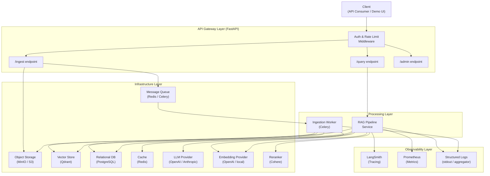

# 🚀 Production-Grade RAG System

[](https://github.com/ismail-yahya/production-rag-system/actions/workflows/ci.yml)
[](https://opensource.org/licenses/MIT)
[](https://www.python.org/downloads/release/python-3120/)
[](TASKS.md)

This is a production-grade Retrieval-Augmented Generation (RAG) system built with a focus on scalability, security, and developer productivity. It implements a multi-tenant architecture with hybrid retrieval, automated ingestion, and robust evaluation.

---

## 🏗️ Architecture Overview

The system follows a service-oriented architecture with four clearly bounded layers:



### Modular Layers:

- **Ingestion Layer**: Asynchronous document parsing (PDF, Images), cleaning, and chunking. Uses Celery for background processing and MinIO for object storage.
- **Retrieval Layer**: Implements Hybrid Search (Vector + BM25) with Reciprocal Rank Fusion (RRF) and Cohere Reranking for maximum precision.
- **RAG Pipeline**: Orchestrates query expansion, context construction with token management, and secure LLM response generation with prompt injection protection.
- **API Layer**: FastAPI-based RESTful API with tenant isolation, rate limiting, and global exception handling.
- **Observability**: End-to-end tracing with LangSmith, real-time metrics with Prometheus, and structured JSON logging with `structlog`.

---

## 🛠️ Tech Stack

| Component | Technology |
|---|---|
| **Framework** | FastAPI (Python 3.12) |
| **Vector Database** | Qdrant |
| **Relational DB** | PostgreSQL & SQLAlchemy |
| **Cache & Task Broker** | Redis |
| **Task Queue** | Celery |
| **Parsing** | PyMuPDF4LLM |
| **Evaluation** | RAGAS |
| **Deployment** | Docker & Docker Compose |

---

## 🚀 Getting Started

### 1️⃣ Environment Setup
```bash
# Install dependencies
uv sync
# Copy env template
cp .env.example .env
```

### 2️⃣ Infrastructure
```bash
# Start local development services
docker compose up -d
# Run migrations
uv run alembic upgrade head
```

### 3️⃣ Running the System
```bash
# Start API
uv run uvicorn src.api.main:app --reload
# Start Celery Worker
uv run celery -A src.workers.celery_app worker --loglevel=info
```

### 4️⃣ Launching the Demo
```bash
# Start Streamlit interface
uv run streamlit run demo/app.py
```

---

## 🧪 Testing & CI

The system enforces 100% test coverage for core modules and critical logic.

```bash
# Run all tests
uv run pytest
# Run with coverage
uv run pytest --cov=src --cov-report=html
```

**CI Pipeline**: GitHub Actions automatically runs linting (Ruff), type checking (Mypy), and the full test suite on every PR.

---

## 🚢 Production Deployment

For production environments, use the optimized Docker profile:

```bash
docker compose -f infrastructure/docker-compose.prod.yml up -d
```

This configuration includes resource limits, internal network isolation, and optimized worker concurrency.

---

## 📊 Benchmarks & Quality

- **Retrieval Latency**: < 200ms (P95) for collections up to 100k chunks.
- **Generation Quality**: Evaluated via RAGAS (Faithfulness, Answer Relevancy, Context Recall).
- **Security**: Regex-based prompt injection detection and tenant-scoped retrieval filters.

---

## ✅ Project Status: Milestone 6 Completed

| Milestone | Status | Key Deliverables |
|---|---|---|
| 1. Foundation | ✅ | Env setup, Docker, CI scaffold |
| 2. Provider Abstractions | ✅ | LLM/Embedder/VectorStore Factories |
| 3. Ingestion Pipeline | ✅ | Async PDF/Image processing |
| 4. Retrieval & RAG | ✅ | Hybrid search, Reranking, SSE Streaming |
| 4a. Observability | ✅ | LangSmith, Prometheus, Semantic Cache |
| 5. Evaluation | ✅ | RAGAS quality gate in CI |
| 6. Final Polish | ✅ | 100% coverage, Demo app, Prod Docker |

---
Developed and maintained by Ismail Yahya
