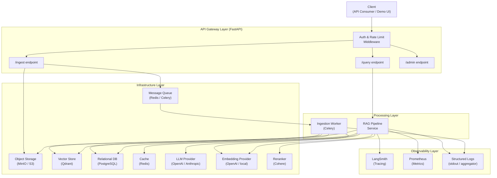
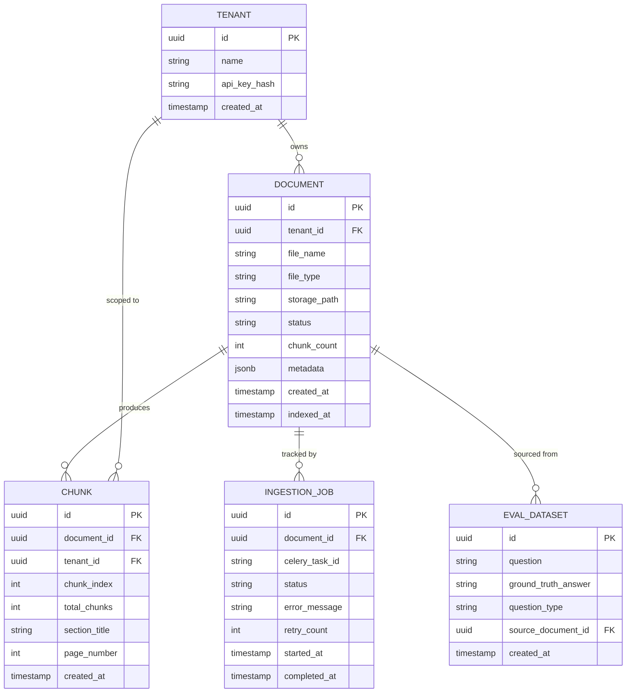

# Technical Design Document: Production-Grade RAG System

## 1. Architecture Overview

The system follows a service-oriented architecture decomposed into four clearly bounded layers: an API Gateway layer (request validation, auth, rate limiting), a Processing layer (ingestion pipeline and RAG query pipeline), an Infrastructure layer (vector store, relational DB, cache, object storage, message queue), and an Observability layer (tracing, metrics, structured logs).

Document ingestion is handled asynchronously: the API accepts a file, persists it to object storage, enqueues a background task, and returns immediately. A worker process picks up the task, runs the full ingestion pipeline (extract → clean → chunk → embed → index), and updates document status in the relational database. This decoupling satisfies NFR-2 (scalability) and NFR-4 (reliability with retry).

Query handling is synchronous and streaming-capable: the API receives a natural language question, runs the full RAG pipeline (expand → retrieve → rerank → build context → generate), and streams the response token-by-token. Tenant scoping is enforced at the retrieval filter layer before any vector search executes.

All provider integrations (LLM, embedder, vector store) are accessed exclusively through abstract interfaces. Concrete implementations are resolved at startup via factory classes driven by environment configuration, satisfying FR-21 and NFR-7.



## 2. Technology Stack

| Layer | Technology | Rationale |
|---|---|---|
| **Backend Framework** | FastAPI (Python 3.12) | Async-native HTTP framework with first-class OpenAPI support; required for streaming responses (FR-11) and async pipeline execution. |
| **Task Queue** | Celery + Redis broker | Provides async document ingestion (FR-2), configurable retry with backoff (NFR-4), and durable task state without additional infrastructure. |
| **Vector Store** | Qdrant | Supports native hybrid search combining dense and sparse vectors (FR-7), runs fully locally via Docker (NFR-6), and provides collection-level filtering for tenant isolation (NFR-3). |
| **Relational DB** | PostgreSQL | Stores document metadata, ingestion status, and tenant records; provides durable state that the vector store does not own. |
| **Cache** | Redis | Serves dual purpose: Celery broker and semantic query cache (FR-20); avoids a second cache infrastructure dependency. |
| **Object Storage** | MinIO (local) / S3 (cloud) | Decouples file storage from processing; files are stored before the ingestion task is enqueued, ensuring no data loss on worker failure. |
| **LLM Provider** | OpenAI / Anthropic (via abstraction) | Both providers are accessed through `BaseLLM`; the active provider is selected via environment config (FR-21). |
| **Embeddings** | OpenAI `text-embedding-3-large` / BGE-M3 (local) | `text-embedding-3-large` provides high-quality multilingual embeddings; BGE-M3 is the local fallback for Arabic and offline use (Technical Consideration: multi-language support). |
| **Reranker** | Cohere Rerank API | Cross-encoder reranking significantly improves precision post-retrieval (FR-8); accessed through an abstract interface so it can be replaced or disabled. |
| **Observability — Tracing** | LangSmith | Provides per-stage pipeline tracing (FR-15, NFR-5) with native RAG pipeline awareness; instrumented via decorator pattern. |
| **Observability — Metrics** | Prometheus client | Exposes request latency, token usage, and retrieval counts (FR-16) via `/metrics` endpoint; standard scrape target for Grafana. |
| **Logging** | structlog (JSON output) | Emits structured, machine-parseable logs (FR-17) compatible with any log aggregation backend without infrastructure coupling. |
| **Evaluation** | RAGAS library | Provides faithfulness, answer relevancy, context recall, and context precision metrics (FR-12) with LLM-as-evaluator pattern. |
| **Containerization** | Docker + Docker Compose | Required for fully local deployment with no cloud dependencies (NFR-6); all infrastructure services run as Compose services. |
| **CI/CD** | GitHub Actions | Hosts the evaluation quality gate (FR-13); runs RAGAS evaluation on the committed dataset and fails the pipeline on threshold regression. |
| **Demo Interface** | Streamlit | Minimal single-file UI sufficient for end-to-end pipeline verification; no UX investment required beyond functional demonstration. |

## 3. Data Models & Schema



**Entity descriptions:**

**TENANT** — Represents an isolated data partition. Every retrieval operation is filtered by `tenant_id` at the vector store layer before results are returned. The `api_key_hash` field stores a hashed credential; plaintext keys are never persisted.

**DOCUMENT** — Tracks each uploaded file from receipt through indexing. The `status` field drives the ingestion state machine: `pending → processing → indexed | failed`. `metadata` stores extracted document properties (title, author, page count) as a flexible JSONB blob. `storage_path` references the object storage key for the original file.

**CHUNK** — Records chunk-level metadata in PostgreSQL for audit and evaluation purposes. The actual chunk content and embedding vector live in Qdrant, keyed by the chunk's UUID. `section_title` and `page_number` are populated by the loader/chunker and surfaced in source attribution (FR-10).

**INGESTION_JOB** — Provides visibility into background task execution. Linked to a Celery task ID for correlation. `retry_count` is incremented by the Celery retry mechanism; `error_message` captures the last exception for debugging.

**EVAL_DATASET** — Stores versioned question/ground-truth pairs committed to the repository. `question_type` (factual, analytical, comparative) enables stratified evaluation reporting. Sourced either manually or via the dataset generator (FR-14).

## 4. API Design

### Document Ingestion

| Method | Endpoint | Description | Auth Required |
|---|---|---|---|
| POST | `/v1/ingest` | Upload a document for async ingestion | Yes |
| GET | `/v1/documents` | List documents for the authenticated tenant | Yes |
| GET | `/v1/documents/{document_id}` | Get ingestion status and metadata for a document | Yes |
| DELETE | `/v1/documents/{document_id}` | Remove a document and its indexed chunks | Yes |

**Key Request / Response Shapes**

`POST /v1/ingest`
```
Request:  multipart/form-data
  - file: binary (PDF or image, max size enforced by gateway)
  - metadata: optional JSON string (e.g., {"tags": ["finance"], "description": "Q3 report"})

Response 202 Accepted:
{
  "document_id": "uuid",
  "status": "pending",
  "message": "Document accepted for processing"
}
```

`GET /v1/documents/{document_id}`
```
Response 200:
{
  "document_id": "uuid",
  "file_name": "string",
  "status": "pending | processing | indexed | failed",
  "chunk_count": integer | null,
  "indexed_at": "ISO8601 timestamp | null",
  "metadata": { ... }
}
```

---

### Query

| Method | Endpoint | Description | Auth Required |
|---|---|---|---|
| POST | `/v1/query` | Submit a natural language query; returns full response | Yes |
| POST | `/v1/query/stream` | Submit a query; streams answer tokens via SSE | Yes |

**Key Request / Response Shapes**

`POST /v1/query`
```
Request:
{
  "question": "string",
  "filters": {
    "document_ids": ["uuid", ...],   // optional: scope to specific documents
    "tags": ["string", ...]          // optional: metadata-based filter
  },
  "mode": "standard | strict"        // strict applies anti-hallucination prompt
}

Response 200:
{
  "answer": "string",
  "sources": [
    {
      "source_id": integer,
      "document_id": "uuid",
      "file_name": "string",
      "section_title": "string | null",
      "page_number": integer | null,
      "relevance_score": float,
      "snippet": "string"
    }
  ],
  "query_expansions": ["string", ...],
  "retrieval_count": integer,
  "model": "string",
  "latency_ms": float
}
```

`POST /v1/query/stream`
```
Response: text/event-stream (SSE)
  - Events: { "type": "token", "content": "string" }
  - Final event: { "type": "sources", "sources": [...] }
  - Terminal event: { "type": "done" }
```

---

### Admin

| Method | Endpoint | Description | Auth Required |
|---|---|---|---|
| GET | `/v1/admin/stats` | Retrieval and ingestion aggregate metrics | Admin role |
| POST | `/v1/admin/eval/run` | Trigger an evaluation run against the committed dataset | Admin role |
| GET | `/v1/admin/eval/results` | Retrieve the latest evaluation scores | Admin role |

---

### Health & Observability

| Method | Endpoint | Description | Auth Required |
|---|---|---|---|
| GET | `/health` | Liveness check | No |
| GET | `/ready` | Readiness check (verifies DB and vector store connectivity) | No |
| GET | `/metrics` | Prometheus metrics scrape endpoint | No (network-restricted) |

## 5. Frontend Architecture

The demo interface is a single-page Streamlit application. Its sole purpose is end-to-end pipeline verification; no production UX investment is made here.

**Page structure:**

- **Upload Panel** — File picker for PDF/image upload; calls `POST /v1/ingest` and polls `GET /v1/documents/{id}` to display status. Shows chunk count and indexed timestamp on completion.
- **Query Panel** — Text input for natural language question; mode selector (standard/strict); optional document filter. Calls `POST /v1/query/stream` and renders streamed answer tokens progressively. Displays source attribution cards below the answer on stream completion.
- **Documents Panel** — Table view of all indexed documents for the current tenant with status, chunk count, and delete action.

**State management:** Streamlit's native session state is sufficient for the demo scope. No external state management library is required.

**Data flow:** All API calls originate from the Streamlit server process to the FastAPI backend; there is no direct client-to-backend communication. The SSE stream is consumed server-side and re-rendered via Streamlit's `st.write_stream` or equivalent progressive rendering mechanism.

**Routing:** Streamlit's single-page model with sidebar navigation between Upload, Query, and Documents views.

## 6. Security Design

**Authentication**

API requests are authenticated via Bearer tokens passed in the `Authorization` header. For MVP, tokens are pre-issued API keys stored as hashed values in the `TENANT.api_key_hash` field (bcrypt). JWT-based auth is noted as a Phase 2 upgrade path but is not required for a portfolio deployment.

**Authorization**

Two roles are defined: `tenant_user` (can ingest and query within their own tenant) and `admin` (can access aggregate stats and trigger eval runs). Role is encoded in the token payload and validated by FastAPI dependency injection on each request. The tenant isolation middleware (FR-19) extracts `tenant_id` from the authenticated token and injects it as a mandatory filter into every vector store search call — this is enforced in the retrieval layer, not the application layer, satisfying NFR-3.

**Data Security**

- All data in transit is protected by TLS (enforced at the reverse proxy layer in any non-local deployment).
- API keys are never stored in plaintext; only bcrypt hashes are persisted.
- Original files in object storage are addressed by opaque UUIDs, not original filenames.
- No user PII is required or collected; the system operates on document content only.

**Input Validation**

- File type and size are validated at the API gateway before any processing begins; unsupported types are rejected with `415 Unsupported Media Type`.
- Query strings are passed through `SecurityGuard.sanitize_query()` before entering the RAG pipeline; detected injection patterns raise a `400 Bad Request` (FR-18).
- Context injected into LLM prompts is sanitized by `SecurityGuard.sanitize_context()` to neutralize instruction injection embedded in document content.
- All request bodies are validated via Pydantic models; malformed payloads are rejected before reaching business logic.

## 7. Infrastructure & Deployment

**Local Development (Docker Compose)**

All infrastructure services run as Compose services: FastAPI app, Celery worker, Qdrant, PostgreSQL, Redis, and MinIO. A single `docker compose up` brings the full system to a running state with no external dependencies. Environment variables are managed via `.env` file (`.env.example` committed; `.env` gitignored).

**Service boundaries in Compose:**
- `api` — FastAPI application
- `worker` — Celery ingestion worker (same image as `api`, different entrypoint)
- `qdrant` — Vector store
- `postgres` — Relational DB
- `redis` — Cache and Celery broker
- `minio` — Object storage

**Environment structure:**
- `development` — Docker Compose, debug logging, no rate limiting
- `production` — Docker Compose production profile (resource limits, no debug), or Kubernetes (Phase 2)

**CI/CD Pipeline (GitHub Actions)**

Two workflows:

1. **`ci.yml`** — Triggered on every pull request: runs unit and integration tests, linting, and type checking.
2. **`eval.yml`** — Triggered on merge to `main`: spins up the full stack, runs RAGAS evaluation against the committed dataset, and fails the workflow if any metric falls below threshold (FR-13). A failed eval gate blocks deployment.

**Database migrations** are managed via Alembic. Migration scripts are committed to the repository and run automatically on container startup in development; run explicitly in production before service restart.

**Secrets management:** API keys for external providers (OpenAI, Cohere, Anthropic) are injected via environment variables. No secrets are committed to the repository. In production, secrets are sourced from environment-level configuration (e.g., cloud secrets manager or Kubernetes secrets).

## 8. Non-Functional Requirements Coverage

- **NFR-1 (Performance)**: Query latency is instrumented per pipeline stage via Prometheus histograms (FR-16). Semantic caching (FR-20) short-circuits the full pipeline for repeated semantically similar queries. Batch embedding calls are used during ingestion to minimize embedding API round-trips. Benchmark results are published in the README.

- **NFR-2 (Scalability)**: Document ingestion is fully decoupled from the API via Celery task queue. Multiple worker instances can be run in parallel by scaling the `worker` Compose service or Kubernetes deployment. The API remains responsive under concurrent upload load regardless of worker throughput.

- **NFR-3 (Security)**: Tenant isolation is enforced at the Qdrant filter layer — every vector search includes a `tenant_id` must-match filter injected by the tenant isolation middleware. This is architectural, not policy-based: a query without a valid tenant token cannot reach the retrieval layer.

- **NFR-4 (Reliability)**: Celery tasks are configured with `max_retries=3` and `default_retry_delay=60s`. Failed ingestion jobs update `INGESTION_JOB.status` to `failed` with the exception captured in `error_message`, enabling manual inspection and requeue without data loss.

- **NFR-5 (Observability)**: LangSmith tracing covers the full RAG pipeline end-to-end via the `@traceable` decorator. Prometheus metrics export per-stage latency, token usage by model and type, and retrieval document counts. All metrics are observable without code modification after initial instrumentation.

- **NFR-6 (Portability)**: The complete system runs via `docker compose up` with no external cloud service required. All provider integrations (LLM, embedder, vector store) have local alternatives: Ollama for LLM, BGE-M3 via sentence-transformers for embeddings, and Qdrant runs locally. MinIO replaces S3 locally.

- **NFR-7 (Maintainability)**: All provider integrations implement abstract base classes (`BaseLLM`, `BaseEmbedder`, `BaseVectorStore`). New providers are added by implementing the interface and registering in the factory — no existing code is modified. This is enforced by the factory pattern and validated by the existing test suite.

## 9. Open Questions & Decisions

- **Reranker availability as a hard dependency**: Cohere Rerank is currently the only reranker implementation. If the Cohere API is unavailable, the pipeline degrades silently to returning vector search results without reranking. Decision needed: should a local cross-encoder reranker (e.g., `cross-encoder/ms-marco-MiniLM`) be included as a fallback, or is Cohere treated as a required external dependency with documented setup requirements?

- **RAGAS evaluator LLM**: RAGAS uses an LLM internally to compute faithfulness and answer relevancy. The choice of evaluator LLM materially affects score values and reproducibility. Decision needed: which LLM should be the canonical evaluator for the committed benchmark scores, and should the eval workflow pin a specific model version?

- **API key auth vs. JWT for MVP**: The current design uses pre-issued hashed API keys for simplicity. If the demo interface requires user-facing login, a JWT-based auth flow adds meaningful complexity. Decision needed: is user-facing authentication a Phase 1 requirement, or is API key auth sufficient for portfolio demonstration purposes?

- **Semantic cache consistency boundary**: The semantic cache returns a cached response for queries above a similarity threshold. If the underlying document corpus changes (new documents indexed, documents deleted), cached responses may become stale or incorrect. Decision needed: should cache entries be invalidated per-tenant on any ingestion event, or is TTL-based expiry sufficient given the portfolio context?

- **BM25 implementation scope**: The current design runs BM25 over in-memory vector search results as a lightweight keyword signal. For production-grade keyword search, a dedicated full-text search engine (e.g., PostgreSQL FTS or Elasticsearch) would be more appropriate. Decision needed: is in-memory BM25 over retrieved candidates acceptable for MVP benchmark purposes, or should PostgreSQL FTS be integrated in Phase 1 to demonstrate a more credible hybrid search implementation?
