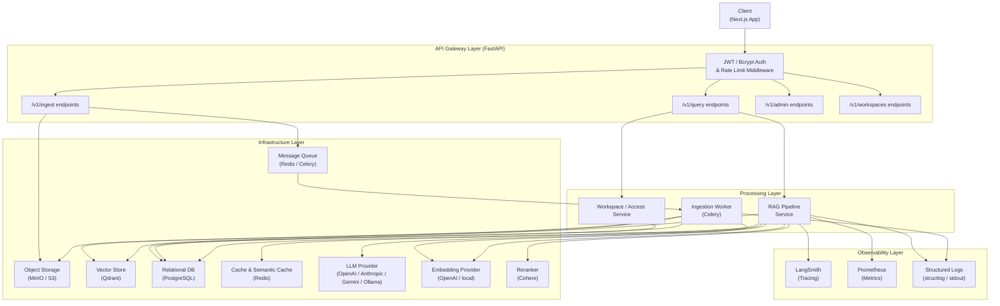
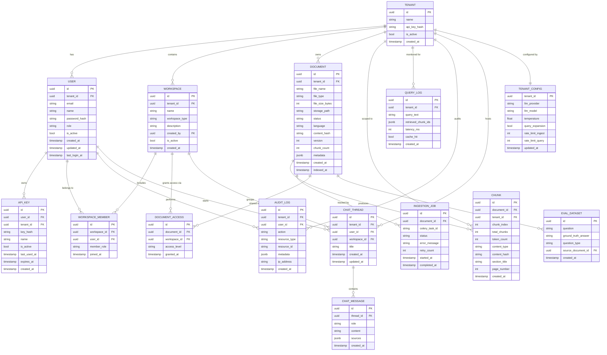

# Technical Design Document: Production-Grade RAG System

## 1. Architecture Overview

The system follows a service-oriented architecture decomposed into four clearly bounded layers: an API Gateway layer (request validation, JWT/Bcrypt authentication, per-tenant/endpoint rate limiting), a Processing layer (async ingestion pipeline, workspace-scoped RAG query pipeline, and session history management), an Infrastructure layer (vector store, relational DB, cache, object storage, message queue, and LLM/Embedding providers), and an Observability layer (tracing, metrics, structured logs).

Document ingestion is handled asynchronously: the API accepts a file, links it to the requesting workspace and tenant, persists it to object storage, enqueues a background task, and returns immediately. A worker process picks up the task, runs the ingestion pipeline (extract → clean → chunk → embed → index in Qdrant), and updates document status and chunks metadata in the relational database.

Query handling is synchronous and streaming-capable: the Next.js client submits a question to FastAPI, which extracts user session state (role and active workspaces), retrieves the authorized document ID allowlist, injects these constraints as a pre-filter into Qdrant, and runs the RAG pipeline (query expansion → retrieve → rerank → context assembly → LLM generation) while streaming back SSE tokens.

All provider integrations (LLM, embedder, vector store) are accessed exclusively through abstract interfaces. Concrete implementations are resolved at startup via factory classes driven by environment configuration, satisfying FR-21 and NFR-7.



## 2. Technology Stack

| Layer | Technology | Rationale |
|---|---|---|
| **Frontend UI** | Next.js + React + TypeScript + Tailwind CSS | Production-ready frontend, optimized for performance, component reusability, secure session handling, and real-time SSE streaming. |
| **Backend Framework** | FastAPI (Python 3.12) | Async-native HTTP framework with first-class OpenAPI support; required for streaming responses (FR-11) and async pipeline execution. |
| **Task Queue** | Celery + Redis broker | Provides async document ingestion (FR-2), configurable retry with backoff (NFR-4), and durable task state without additional infrastructure. |
| **Vector Store** | Qdrant | Supports native hybrid search combining dense and sparse vectors (FR-7), runs fully locally via Docker (NFR-6), and provides metadata-level pre-filtering for tenant & workspace isolation. |
| **Relational DB** | PostgreSQL | Stores document metadata, user records, workspace associations, document access rights, audit logs, and thread histories. |
| **Cache** | Redis | Serves dual purpose: Celery broker and semantic query cache (FR-20) with workspace-aware invalidation; avoids a second cache infrastructure dependency. |
| **Object Storage** | MinIO (local) / S3 (cloud) | Decouples file storage from processing; files are stored before the ingestion task is enqueued, ensuring no data loss on worker failure. |
| **LLM Provider** | OpenAI / Anthropic / Gemini / Ollama (via abstraction) | All providers are accessed through `BaseLLM` and resolved via `LLMFactory` (FR-21). |
| **Embeddings** | OpenAI `text-embedding-3-large` / BGE-M3 (local) | `text-embedding-3-large` provides high-quality multilingual embeddings; BGE-M3 is the local fallback for Arabic and offline use. |
| **Reranker** | Cohere Rerank API | Cross-encoder reranking significantly improves precision post-retrieval (FR-8); accessed through an abstract interface so it can be replaced or disabled. |
| **Observability — Tracing** | LangSmith | Provides per-stage pipeline tracing (FR-15, NFR-5) with native RAG pipeline awareness; instrumented via decorator pattern. |
| **Observability — Metrics** | Prometheus client | Exposes request latency, token usage, and retrieval counts (FR-16) via `/metrics` endpoint; standard scrape target for Grafana. |
| **Logging** | structlog (JSON output) | Emits structured, machine-parseable logs (FR-17) compatible with any log aggregation backend. |
| **Evaluation** | RAGAS library | Provides faithfulness, answer relevancy, context recall, and context precision metrics (FR-12) with LLM-as-evaluator pattern. |
| **Containerization** | Docker + Docker Compose | Required for fully local deployment with no cloud dependencies (NFR-6); all infrastructure services run as Compose services. |
| **CI/CD** | GitHub Actions | Hosts the evaluation quality gate (FR-13); runs RAGAS evaluation on the committed dataset and fails the pipeline on threshold regression. |

## 3. Data Models & Schema



**TENANT** — Represents an isolated data partition. The `api_key_hash` field stores a hashed credential; plaintext keys are never persisted. `is_active` allows for soft-disabling a tenant.

**USER** — Represents an individual user within a tenant. Stores credentials (`password_hash`), status (`is_active`), and their overall system authorization level via the `role` column (SUPER_ADMIN, ADMIN, MANAGER, USER).

**API_KEY** — Stores programmatic API keys associated with a user, ensuring that developer access uses bcrypt-hashed API keys (`key_hash`) instead of raw key checks.

**WORKSPACE** — Logical sub-partitions within a tenant (e.g., TEAM or PERSONAL) used to group files.

**WORKSPACE_MEMBER** — Intersection table mapping users to workspaces, defining workspace-specific roles (e.g., ADMIN, MEMBER, VIEWER).

**DOCUMENT_ACCESS** — Controls document visibility by linking files to workspaces. This allowlist is evaluated by `get_accessible_document_ids()` to construct pre-filters during vector searches.

**DOCUMENT** — Tracks each uploaded file from receipt through indexing. `metadata` stores extracted properties as a JSONB blob. `storage_path` references the object storage key.

**CHUNK** — Records chunk-level metadata. The actual chunk text and embeddings reside in Qdrant.

**INGESTION_JOB** — Tracks celery task state (`pending → processing → indexed | failed`) and counts retries.

**QUERY_LOG** — Captures RAG query history, query strings, and retrieved chunk IDs for quality analysis.

**AUDIT_LOG** — Immutable append-only ledger capturing all critical user activities (e.g., queries, log-ins, uploads, role modifications).

**CHAT_THREAD & CHAT_MESSAGE** — Maintains persistent chat history and assistant source references per thread.

**TENANT_CONFIG** — Dynamically stores system overrides (e.g., default models, temperature, rate limit thresholds) for each tenant.

**EVAL_DATASET** — Stores versioned question/ground-truth pairs for automated RAGAS quality evaluation.

## 4. API Design

### Authentication
| Method | Endpoint | Description | Auth Required |
|---|---|---|---|
| POST | `/v1/auth/login` | Authenticate via email/password and obtain JWT | No |
| POST | `/v1/auth/refresh` | Obtain a new JWT using refresh token | No |
| POST | `/v1/auth/api-keys` | Generate a new programmatic API key | Yes |

### User Management
| Method | Endpoint | Description | Auth Required |
|---|---|---|---|
| POST | `/v1/users` | Create a new user (ADMIN only) | Yes |
| GET | `/v1/users` | List users in the tenant (ADMIN only) | Yes |
| PATCH | `/v1/users/{user_id}` | Modify user role or status (ADMIN only) | Yes |

### Document Ingestion & Workspaces
| Method | Endpoint | Description | Auth Required |
|---|---|---|---|
| POST | `/v1/workspaces` | Create a new logical workspace | Yes |
| GET | `/v1/workspaces` | List active workspaces for the user | Yes |
| POST | `/v1/ingest` | Upload a document, optionally specifying `workspace_id` | Yes |
| GET | `/v1/documents` | List documents inside the user's workspaces | Yes |
| DELETE | `/v1/documents/{document_id}` | Remove a document from object storage, PostgreSQL, and Qdrant | Yes |

### Conversational Query
| Method | Endpoint | Description | Auth Required |
|---|---|---|---|
| POST | `/v1/chat/threads` | Create a new chat session thread | Yes |
| POST | `/v1/query` | Submit a RAG question within a thread (blocking) | Yes |
| POST | `/v1/query/stream` | Submit a query and stream SSE answer tokens | Yes |

---

## 5. Frontend Architecture

The user interface is a modern, single-page application built using **Next.js**, **React**, **TypeScript**, and **Tailwind CSS**.

### Key Pages & Layouts
- **Login / Authentication**: Collects credentials and stores the JWT securely in client cookies or memory.
- **Workspace Dashboard**: Tabbed view allowing Workspace Admins to add/remove members and assign files.
- **Documents Portal**: Handles multipart file uploads (PDF/Images) and polls `/v1/documents/{id}` for processing status.
- **Chat Interface**: An interactive messenger UI consuming the SSE token stream, rendering markdown, and highlighting source citation attachments (page numbers, document names, and snippet highlights).
- **Audit Logs View**: Tabular ledger view for compliance managers to search log events.

---

## 6. Security Design

### Authentication
API endpoints are secured by JWT bearer sessions for web users, and bcrypt-hashed API keys for external program access. In both paths, the gateway middleware verifies credentials and loads a complete `User` context instead of a raw tenant string.

### Workspace & Document-Level Authorization
Access control checks are enforced at the query boundary, preventing information leakage:
1. When a query is received, the API Gateway resolves the calling user's authorized workspaces.
2. The `WorkspaceService` queries `document_access` to collect all `document_ids` mapped to those workspaces.
3. This list of `allowed_ids` is passed directly to the `HybridRetriever`.
4. In `QdrantVectorStore`, the search filters are compiled to apply a strict `$in` matching filter on the metadata payload:
   ```json
   {
     "and": [
       { "key": "tenant_id", "match": { "value": "<tenant-uuid>" } },
       { "key": "document_id", "match": { "any": ["<allowed-doc-uuid>", ...] } }
     ]
   }
   ```
This ensures the LLM context is constructed *only* from fragments the user has explicit rights to see.

### Audit Trails
Every mutating API action (upload, delete, workspace addition) and query request logs an immutable, append-only entry in `audit_logs` capturing IP address, user UUID, action type, and target resource metadata.

---

## 7. Infrastructure & Deployment

**Local Development (Docker Compose)**

All infrastructure services run as Compose services: FastAPI app, Next.js frontend, Celery worker, Qdrant, PostgreSQL, Redis, and MinIO. Alembic migrations and Qdrant collection setup execute automatically in a pre-start container.

---

## 8. Non-Functional Requirements Coverage

- **NFR-1 (Performance)**: Latency histograms measure performance per stage. Semantic caching short-circuits execution for repeated queries.
- **NFR-2 (Scalability)**: Async ingestion enqueues files to Celery, allowing worker tasks to scale independently.
- **NFR-3 (Security)**: Data boundaries are enforced at retrieval time by resolving user permissions into document lists and pre-filtering the vector search.
- **NFR-4 (Reliability)**: Celery handles job execution retries.
- **NFR-5 (Observability)**: LangSmith traces RAG pipeline stages.
- **NFR-6 (Portability)**: The entire stack runs via Docker Compose with local fallbacks.
- **NFR-7 (Maintainability)**: Base provider classes shield business logic from supplier changes.

---

## 9. Open Questions & Decisions

- **Local Reranker Fallback**: Cohere Rerank API remains the default; a local cross-encoder fallback can be integrated.
- **RAGAS Evaluator model**: OpenAI GPT-4o is selected as the default evaluator model for regression quality gate pipelines.
- **Semantic Cache invalidation**: Performed per-tenant on any document deletion or new ingestion index completion.
